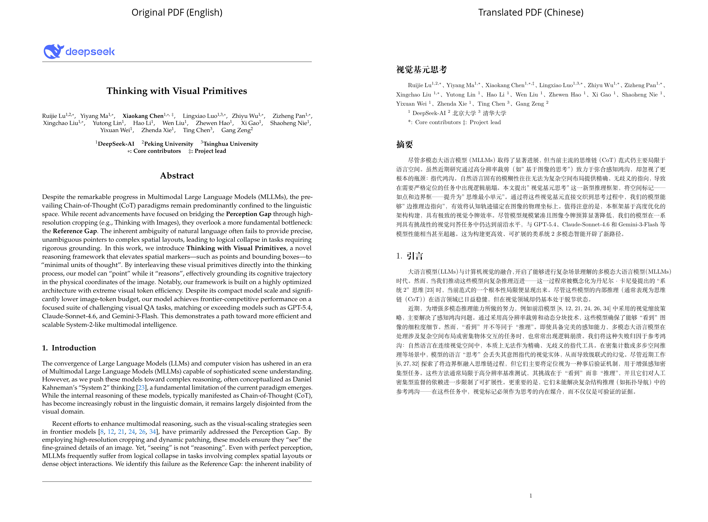
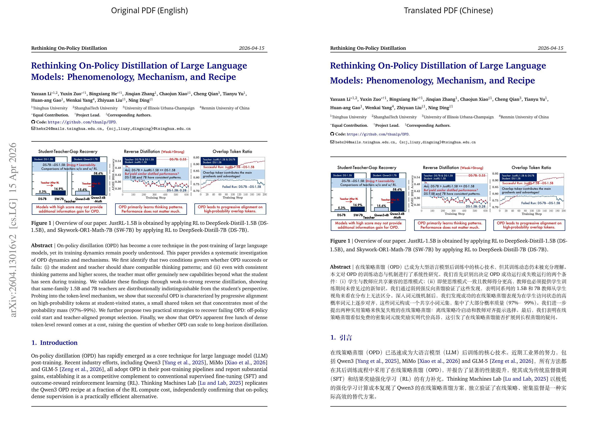

# pdf2zh-skill

`Thinking_with_Visual_Primitives.pdf`:



`arXiv 2604.13016`:



Convert academic PDF papers or arXiv/LaTeX sources into Chinese PDF outputs while preserving LaTeX structure as much as practical.

## What it does

- Prefer arXiv source packages when available
- Parse regular PDFs into TeX projects with `DOC2X`
- Segment translatable prose while preserving fragile LaTeX blocks
- Translate with a user-provided OpenAI-compatible chat completions API
- Build a paper-level glossary and run a consistency review pass
- Compile `merge_中文.tex` into a Chinese PDF
- Generate `vision_pack/` and `quality_report_中文.*` for model review and manual repair

## Output layout

Each `run` creates a unique task folder under the system temp directory:

```text
pdf2zh-skill/YYYYMMDD-HHMMSS-<source_slug>-<short_hash>/
```

The final deliverables are named from the original PDF stem or, for arXiv URLs, the paper title when available:

- `<name>_English.tex`
- `<name>_中文.tex`
- `<name>_中文.pdf`

Internal working files remain stable under `zh/`:

- `merge_English.tex`
- `merge_中文.tex`
- `merge_中文.pdf`
- `segments_English.jsonl`
- `glossary_English.json`
- `translations_中文.jsonl`
- `translations_reviewed_中文.jsonl`
- `consistency_report_中文.json`
- `quality_report_中文.json`
- `quality_report_中文.md`

## Quick start

Create a `.env` from `.env.example` and fill in your credentials:

```dotenv
DOC2X_API_KEY=...
PDF2ZH_TRANSLATION_API_KEY=...
PDF2ZH_TRANSLATION_BASE_URL=...
PDF2ZH_TRANSLATION_MODEL=...
```

Check the effective configuration before a full run:

```bash
python scripts/pdf2zh_pipeline.py check-config
```

If translation config is missing, provide an OpenAI-compatible chat completions `base_url`, `api_key`, and `model`. If a regular PDF needs DOC2X conversion, also provide `DOC2X_API_KEY`.

Then run:

```bash
python scripts/pdf2zh_pipeline.py run --pdf paper.pdf --method doc2x --workers 50
```

For arXiv:

```bash
python scripts/pdf2zh_pipeline.py run --url https://arxiv.org/abs/0000.00000 --workers 50
```

The run output includes `run_summary.json`, Windows-visible paths when running under WSL, a visual review pack, and a quality review report.

## Review workflow

After `run` finishes, inspect:

- `quality_report_中文.md`
- `vision_pack/manifest.json`
- `zh/merge_中文.tex`
- the LaTeX compile log if compilation needs manual repair

The framework handles deterministic cleanup and detection. Complex LaTeX template issues and final visual alignment are intentionally handled by the model by editing `zh/merge_中文.tex` and recompiling.

## Examples

The first example above comes from the DOC2X route.
The second comes from the source-TeX route, where the skill probes arXiv source first and skips DOC2X when the paper source is available.

Raw images are also included:

- `docs/images/thinking_with_visual_primitives_before.png`
- `docs/images/thinking_with_visual_primitives_after.png`
- `docs/images/arxiv_2604_13016_before.png`
- `docs/images/arxiv_2604_13016_after.png`

## Files

- `SKILL.md`: skill contract and operating notes
- `scripts/pdf2zh_pipeline.py`: CLI entrypoint
- `scripts/pdf2zh_skill/`: implementation modules
