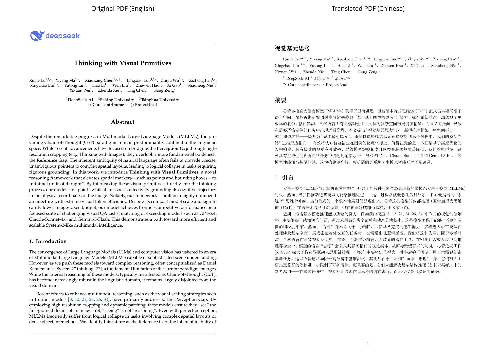
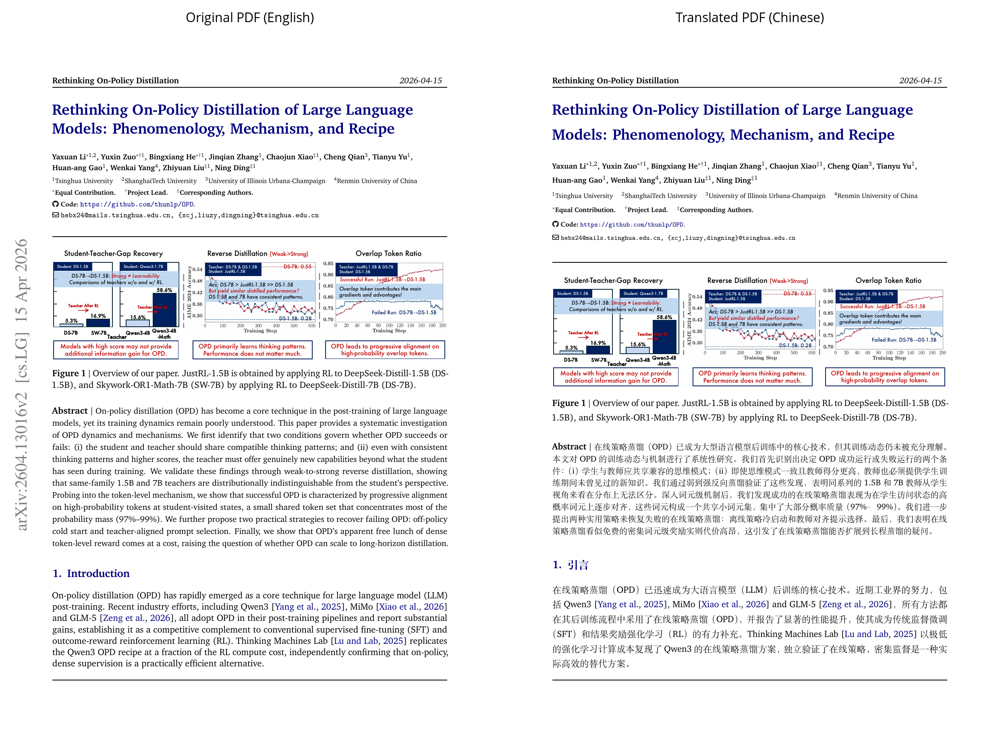

# pdf2zh-skill

`Thinking_with_Visual_Primitives.pdf`:



`arXiv 2604.13016`:



Convert academic PDF papers or arXiv/LaTeX sources into Chinese PDF outputs and sentence-interleaved English/Chinese bilingual PDF outputs while preserving LaTeX structure as much as practical.

## Update path

Use this repository as the update source for the skill:

`https://github.com/fanxing-6/pdf2zh-skill.git`

## What it does

- Prefer arXiv source packages when available
- Parse regular PDFs into TeX projects with `DOC2X`
- Segment translatable prose while preserving fragile LaTeX blocks
- Translate with a user-provided OpenAI-compatible chat completions API
- Build a paper-level glossary and run a consistency review pass
- Compile `merge_中文.tex` into a Chinese PDF
- Compile `merge_中英双语.tex` into a bilingual PDF whose prose alternates English sentence, green Chinese sentence
- Generate `vision_pack/`, `vision_pack_bilingual/`, and `quality_report_中文.*` for model review and final correction

## Output layout

Each `run` creates a unique task folder under a persistent output root. By default this is `PDF2ZH_SKILL_HOME/runs`, or `~/pdf2zh-skill/runs` when `PDF2ZH_SKILL_HOME` is not set. Set `PDF2ZH_SKILL_OUTPUT_DIR` to choose another durable location; `PDF2ZH_SKILL_TMPDIR` is accepted as a compatibility alias, but new configs should prefer `PDF2ZH_SKILL_OUTPUT_DIR`.

```text
pdf2zh-skill/runs/YYYYMMDD-HHMMSS-<source_slug>-<short_hash>/
```

The final deliverables are named from the original PDF stem or, for arXiv URLs, the paper title when available:

- `<name>_English.tex`
- `<name>_中文.tex`
- `<name>_中文.pdf`
- `<name>_中英双语.tex`
- `<name>_中英双语.pdf`

User-facing handoff should point to these named files in the task root. Files named `zh/merge_*` are internal work artifacts; after any manual correction or recompile, copy the updated `merge_*` artifacts back to the named outputs and refresh `run_summary.json`.

Internal working files remain stable under `zh/`:

- `merge_English.tex`
- `merge_中文.tex`
- `merge_中文.pdf`
- `merge_中英双语.tex`
- `merge_中英双语.pdf`
- `segments_English.jsonl`
- `glossary_English.json`
- `translations_中文.jsonl`
- `translations_reviewed_中文.jsonl`
- `consistency_report_中文.json`
- `quality_report_中文.json`
- `quality_report_中文.md`

When a local `--pdf` or `--source-pdf` points at an upload cache or other temporary path, the pipeline copies it into `source/` inside the task folder before conversion and visual review. Completed runs therefore do not depend on the original temp path still existing after a restart.

## Quick start

Create a `.env` from `.env.example` and fill in your credentials:

```dotenv
DOC2X_API_KEY=...
PDF2ZH_TRANSLATION_API_KEY=...
PDF2ZH_TRANSLATION_BASE_URL=...
PDF2ZH_TRANSLATION_MODEL=...
```

Check the effective configuration before a full run:

```bash
python scripts/pdf2zh_pipeline.py check-config
```

If translation config is missing, provide an OpenAI-compatible chat completions `base_url`, `api_key`, and `model`. If a regular PDF needs DOC2X conversion, also provide `DOC2X_API_KEY`.

Then run:

```bash
python scripts/pdf2zh_pipeline.py run --pdf paper.pdf --method doc2x --workers 50
```

For arXiv:

```bash
python scripts/pdf2zh_pipeline.py run --url https://arxiv.org/abs/0000.00000 --workers 50
```

The run output includes `run_summary.json`, Windows-visible paths when running under WSL, a visual review pack, and a quality review report.

## Review workflow

After `run` finishes, inspect:

- `quality_report_中文.md`
- `vision_pack/manifest.json`
- `vision_pack_bilingual/manifest.json`
- `zh/merge_中文.tex`
- `zh/merge_中英双语.tex`
- the LaTeX compile log if compilation needs final correction

The framework handles deterministic cleanup and detection. Complex LaTeX template issues and final visual alignment are intentionally handled by the model by editing `zh/merge_中文.tex` or `zh/merge_中英双语.tex` and recompiling.

## Examples

The first example above comes from the DOC2X route.
The second comes from the source-TeX route, where the skill probes arXiv source first and skips DOC2X when the paper source is available.

Raw images are also included:

- `docs/images/thinking_with_visual_primitives_before.png`
- `docs/images/thinking_with_visual_primitives_after.png`
- `docs/images/arxiv_2604_13016_before.png`
- `docs/images/arxiv_2604_13016_after.png`

## Files

- `SKILL.md`: skill contract and operating notes
- `scripts/pdf2zh_pipeline.py`: CLI entrypoint
- `scripts/pdf2zh_skill/`: implementation modules
